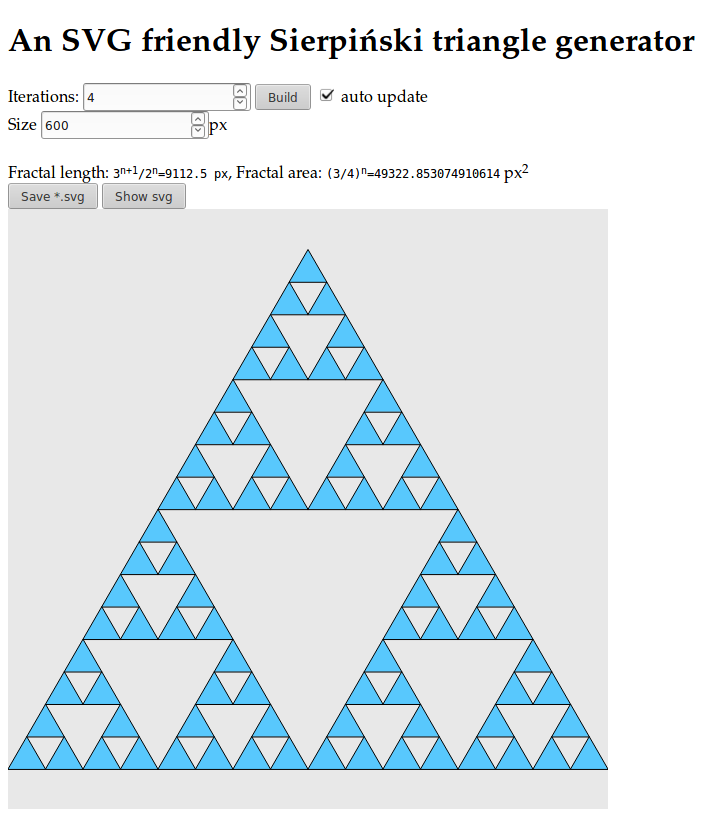

### Sierpiński Triangle SVG Generator ###

See in action on
http://int2byte.de/public/sierpinski/main.html

Screenshot:

* Compute your triangle.
* Export as SVG file.

##### Libraries #####
* jQuery
* FileSaver.js

###### Note ######
The runtime is worst [O(3^n) depending on the number of iterations]. This was just an javascript-to-svg-export proof of concept.

